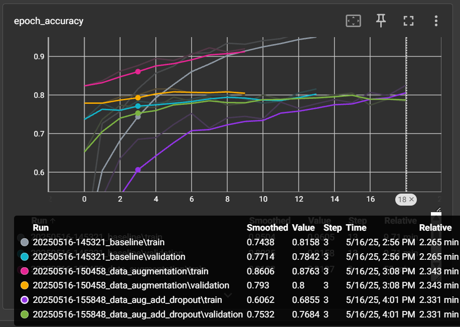
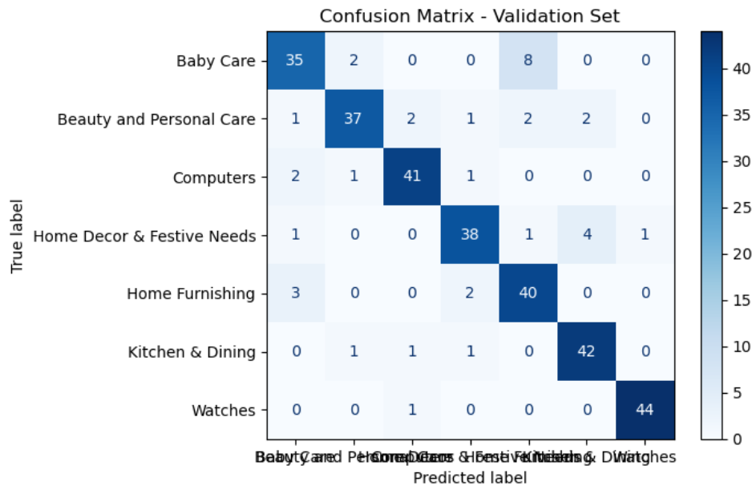

# 🧠 E-Commerce Image Classification using Deep Learning and Transformers

> A professional computer vision pipeline to classify product images for an e-commerce platform, using state-of-the-art deep learning architectures and full deployment via API and interactive dashboard.

---

## 📌 Table of Contents

- [Project Overview](#project-overview)
- [Objectives](#objectives)
- [Technologies Used](#technologies-used)
- [Modeling Approach](#modeling-approach)
- [Evaluation Metrics](#evaluation-metrics)
- [Deployment](#deployment)
- [Vision Transformer (ViT)](#vision-transformer-vit)
- [Results & Comparison](#results--comparison)
- [How to Run](#how-to-run)
- [Author](#author)

---

## 🚀 Project Overview

This project is part of a broader initiative to automate product categorization for an online retail platform using image data. Initially, a Convolutional Neural Network (CNN) and a customized VGG16 model were implemented to classify images into 7 product categories.

The pipeline evolved to incorporate a **Vision Transformer (ViT)**, a modern deep learning architecture that significantly improved classification performance. All model experiments were tracked with **MLflow**, and the best model was deployed using **Heroku (API)** and **Streamlit (dashboard)** for real-time predictions.

---

## 🎯 Objectives

- Automatically classify e-commerce product images into 7 predefined categories.
- Compare the performance of traditional CNN/VGG models with modern transformer-based architectures (ViT).
- Deploy the most effective model in production for business use.

---

## 🛠 Technologies Used

- Python (Jupyter, PyTorch, NumPy, Pandas)
- Deep Learning: CNN, VGG16, Vision Transformer (ViT)
- ML Tracking: MLflow
- Deployment: FastAPI (Heroku), Streamlit
- Version Control: Git & GitHub

---

## 🧪 Modeling Approach

### 1. **Baseline Models**
- Custom CNN and fine-tuned VGG16 (transfer learning)
- Data augmentation (transforms, normalization)
- Cross-validation and early stopping

### 2. **Advanced Modeling with ViT**
- Implementation using PyTorch and HuggingFace/`timm`
- Comparison against CNN/VGG baselines
- Focus on model scalability and generalization

---

## 📈 Evaluation Metrics

| Model     | Accuracy | Precision | Recall | F1-score |
|-----------|----------|-----------|--------|----------|
| VGG16     | 78.4%    | 74.9%     | 78.0%  | 78.9%    |
| ViT       | **87.7%**| **86.5%** | **86.6%** | **87.1%** |

> Metrics tracked using MLflow with full experiment versioning.

### 📈 VGG16 Accuracy on TensorBoard  


### 🧮 Confusion Matrix  


---

## ☁️ Deployment

The best-performing model (ViT) was put into production using:

- **FastAPI** for serving model predictions as a RESTful API
- **Heroku** for cloud deployment
- **Streamlit** as an intuitive user interface for visualizing image predictions

---

## 🔬 Vision Transformer (ViT)

The **Vision Transformer (ViT)** is a groundbreaking architecture that applies the Transformer model—originally designed for natural language processing—to image classification tasks. ViT divides an image into a sequence of fixed-size patches, linearly embeds them, and then processes the sequence with standard Transformer layers.

Key advantages include:
- Global context modeling from the first layer
- Reduced inductive bias compared to CNNs
- State-of-the-art performance on large-scale image datasets


> 📄 Reference Paper:  
**"An Image is Worth 16x16 Words: Transformers for Image Recognition at Scale"**  
By Dosovitskiy et al. (Google Research)  
[Link to paper](https://www.academia.edu/95250851/An_Image_is_Worth_16x16_Words_Transformers_for_Image_Recognition_at_Scale#:~:text=Houlsby%2C%20N.%20%282021%29%20%E2%80%9CAn%20Image%20is%20Worth%2016x16,tasks%2C%20its%20applications%20to%20computer%20vision%20remain%20limited)

---

## 📊 Results & Comparison

The Vision Transformer significantly outperformed the VGG16 model across all key metrics, especially in terms of generalization and robustness to noisy samples. Its ability to learn global dependencies led to better classification performance with fewer inductive constraints.

---

## 💻 How to Run

### 1. Clone the repository

```bash
git clone https://github.com/your-username/ecommerce-image-classification.git
cd ecommerce-image-classification
